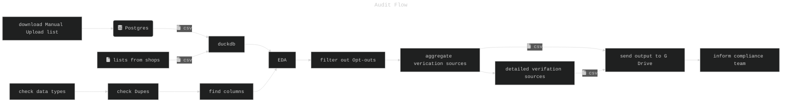

```
___  ___ ______________  ___  ___   _   _
|  \/  ||  ___| ___ \  \/  | / _ \ | \ | |
| .  . || |__ | |_/ / .  . |/ /_\ \|  \| |
| |\/| ||  __||    /| |\/| ||  _  || . ` |
| |  | || |___| |\ \| |  | || | | || |\  |
\_|  |_/\____/\_| \_\_|  |_/\_| |_/\_| \_/

```
# :mermaid: CHARTS :mermaid:

---
Had fun doing some light process mapping for a project at work.

Still so much to explore:
- different icons
- colours
- shapes
- change title font colour

:point_down:



:books: bibliography:
- [ascii art generato](https://patorjk.com/software/taag/#p=display&f=Graffiti&t=Type%20Something%20)r
- [tutorials](https://mermaid.js.org/ecosystem/tutorials.html)
