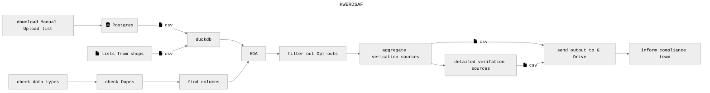

# mermaid_chart

```mermaid

---
title: HWERDSAF

---
%%{
    init:
        {
            'theme':'neutral'
            ,'fontFamily':'monospace'
            ,'darkMode':'true'
        }

}%%

flowchart LR


    A[download Manual Upload list]      --> B(fa:fa-database Postgres)
    B(fa:fa-database Postgres)          --> |fa:fa-file csv| C[duckdb]
    D[fa:fa-file lists from shops]      --> |fa:fa-file csv| C[duckdb]
    C[duckdb]                           --> E[load data]
    F[check data types]                 --> G[check Dupes]
    G[check Dupes]                      --> H[find columns]
    H[find columns]                     --> E[EDA]
    E[EDA]                              --> I[filter out Opt-outs]
    I[filter out Opt-outs]              --> J[aggregate verication sources]
    J[aggregate verication sources]     --> L[detailed verifation sources]
    J[aggregate verication sources]     --> |fa:fa-file csv| M[send output to G Drive]
    L[detailed verifation sources]      --> |fa:fa-file csv| M[send output to G Drive]
    M[send output to G Drive]           --> P[inform compliance team]


    %% A[Christmas] -->|Get money| B(Go shopping)
    %% B --> C{Let me think}
    %% C -->|One| D[Laptop]
    %% C -->|Two| E[iPhone]
    %% C -->|Three| F[fa:fa-car Car]

```
